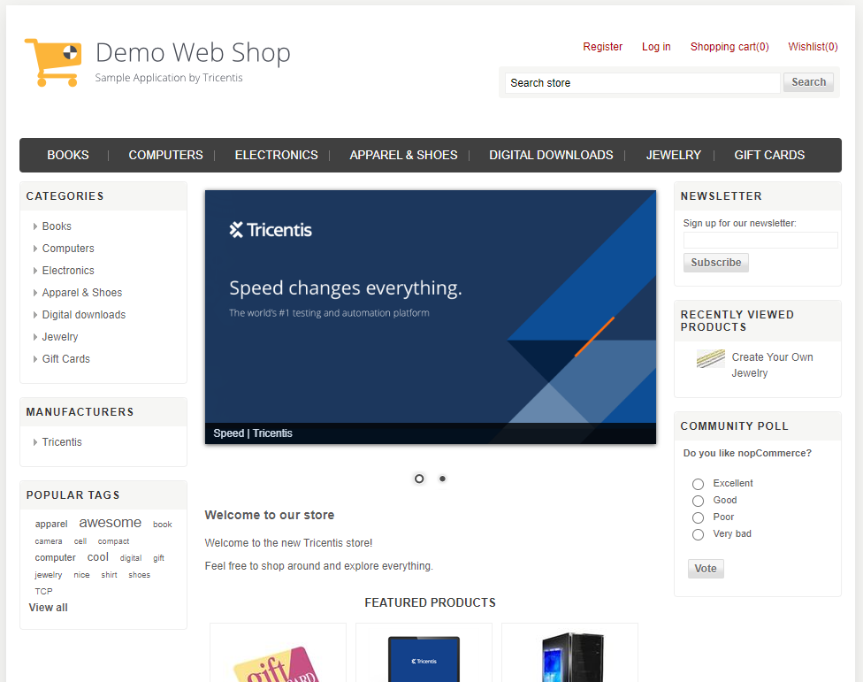

# Capstone Project
This project incorporates C#, Selenium, and Sikuli to test 7 predefined test cases and report on their outcome.
The following website will be used to conduct the test cases.

<a href="https://demowebshop.tricentis.com/">
    
</a>

## Table Of Content
- [How it Works](#how-it-works)
- [Usage](#usage)
- [Test Cases](#test-cases)
    - [Open Home Page](#open-home-page)
    - [Login to Website](#login-to-website)
    - [Select Product Category - Jewelry](#select-product-category---jewelry)
    - [Change Jewelry View](#change-jewelry-view)
    - [Select Create Your Own Jewelry](#select-create-your-own-jewelry)
    - [Checkout Cart](#checkout-cart)
    - [Go to Home Page and Logout](#go-to-home-page-and-logout)
- [Reports](#reports)
- [Configuration](#configuration)

## How It Works
1. The OneTimeSetup function is called and the session, driver, and report objects are created.
2. The test cases are executed/tested and reported.
3. The OneTimeTearDown function is called and the session, driver and report objects are destroyed.

## Usage
Configure the project configuration to use your specified details and run all test cases.

## Test Cases
Here is a list of all 7 test cases, each with more detail on what the test case does.

### Open Home Page
<details><summary><b>Show Detail</b></summary>
This test case opens the base URL and then compates the page title with the configure result.
</details>

### Login to Website
<details><summary><b>Show Detail</b></summary>
This test case opens the base URL and then compates the page title with the configure result.
</details>

### Select Product Category - Jewelry
<details><summary><b>Show Detail</b></summary>
This test case opens the base URL and then compates the page title with the configure result.
</details>

### Change Jewelry View
<details><summary><b>Show Detail</b></summary>
This test case opens the base URL and then compates the page title with the configure result.
</details>

### Select Create Your Own Jewelry
<details><summary><b>Show Detail</b></summary>
This test case opens the base URL and then compates the page title with the configure result.
</details>

### Checkout Cart
<details><summary><b>Show Detail</b></summary>
This test case opens the base URL and then compates the page title with the configure result.
</details>

### Go to Home Page and Logout
<details><summary><b>Show Detail</b></summary>
This test case opens the base URL and then compates the page title with the configure result.
</details>

## Reports
The report after all the test cases have completed is a basic report that shows all the test cases. It will show if the test case passed or failed and if a test case faild it will show the error message with it.

## Configuration
1. User name: ``` private static readonly string _USERNAME = @"addyourusernamehere"; ```
